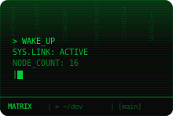
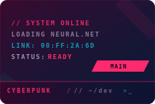
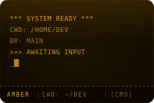
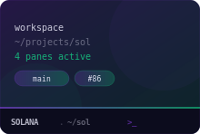
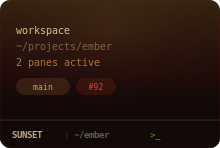

<h1> knkode</h1>

A terminal workspace manager that saves your multi-pane layouts so you stop rebuilding them every morning.

<table>
  <tr>
    <td></td>
    <td></td>
    <td></td>
    <td></td>
  </tr>
  <tr>
    <td></td>
    <td></td>
    <td></td>
    <td></td>
  </tr>
</table>

Each theme has its own visual effects — scanlines, phosphor glow, noise textures, gradient overlays — applied to terminal backgrounds and pane chrome. These aren't color swaps.

## Download

**[Latest release (v2.0.0)](https://github.com/StanK23/knkode/releases/latest)**

| Platform | File |
|---|---|
| macOS (Apple Silicon + Intel) | [knkode_2.0.0_universal.dmg](https://github.com/StanK23/knkode/releases/download/v2.0.0/knkode_2.0.0_universal.dmg) |
| Windows (installer) | [knkode_2.0.0_x64-setup.exe](https://github.com/StanK23/knkode/releases/download/v2.0.0/knkode_2.0.0_x64-setup.exe) |
| Windows (MSI) | [knkode_2.0.0_x64_en-US.msi](https://github.com/StanK23/knkode/releases/download/v2.0.0/knkode_2.0.0_x64_en-US.msi) |

## Why

Every project needs a different terminal setup — build watcher, dev server, logs, a shell for git. You arrange them, close the window, and rebuild the whole thing next time. knkode saves each arrangement as a named workspace you can switch between instantly.

## What it does

**Workspaces as tabs.** Each workspace is a color-coded tab with its own split-pane layout. Create, duplicate, close, drag to reorder, or reopen from the closed-workspaces menu. Switching is instant — background shells stay alive.

**Split panes.** Six layout presets plus split any pane on the fly. Drag pane headers to rearrange — drop on center to swap, drop on an edge to insert. Move panes across workspaces via right-click.

**16 themes.** 8 identity themes with unique visual effects (Matrix, Cyberpunk, Vaporwave, Amber, Solana, Ocean, Sunset, Arctic) and 8 classics (Dracula, Tokyo Night, Nord, Catppuccin, Gruvbox, Monokai, Everforest, Default Dark). Each has custom pane chrome — parallelogram badges, CRT scanlines, gradient borders, retro grids. Applied per-workspace, with per-pane color overrides.

**Sidebar.** Tree-style mission control — workspaces, pane entries with CWD paths, git branch badges, and PR status. Activity indicators pulse when a pane has output (animated border separators with theme-specific styles: scan, wave, ember, shimmer).

**Terminal.** Rust-native terminal emulation via wezterm-term, rendered on a custom HTML canvas. Clickable URLs (Cmd+click), inline images (iTerm2/Kitty/Sixel protocols), CWD tracking in pane headers, file drag-and-drop to paste paths. `Shift+Enter` sends LF instead of CR for tools like Claude Code.

**Quick commands.** Reusable shell snippets per workspace. Run them from the `>_` icon on any pane header.

**Persistent.** Config stored as JSON in `~/.knkode/`. Atomic writes (temp + rename) so crashes don't corrupt state.

## Keyboard shortcuts

`Cmd` on macOS, `Ctrl` on Windows/Linux.

| Action | Shortcut |
|---|---|
| Split side-by-side | `Mod+D` |
| Split stacked | `Mod+Shift+D` |
| Close pane | `Mod+W` |
| Close workspace tab | `Mod+Shift+W` |
| New workspace | `Mod+T` |
| Prev / next workspace | `Mod+Shift+[ / ]` |
| Prev / next pane | `Mod+Alt+Left / Right` |
| Focus pane by number | `Mod+1-9` |
| Scroll to top / bottom | `Mod+Up / Down` |
| Toggle sidebar | `Mod+B` |
| Settings | `Mod+,` |
| Keyboard shortcuts | `Mod+/` |

## Development

Requires [Rust](https://rustup.rs), Node.js >= 18, and [bun](https://bun.sh).

```sh
git clone https://github.com/StanK23/knkode.git
cd knkode
bun install
bun tauri dev
```

Opens the app with hot reload. macOS uses a frameless window with native traffic lights; Windows uses the standard title bar.

```sh
bun run test         # vitest
bun run check        # biome check
bun run build        # compile frontend
bun tauri build      # full app build (.dmg / .exe)
```

Stack: Tauri 2, Rust (wezterm-term + portable-pty), React 19, TypeScript, Zustand 5, Tailwind CSS 4, Vite 6, Biome.

## License

[MIT](LICENSE)
